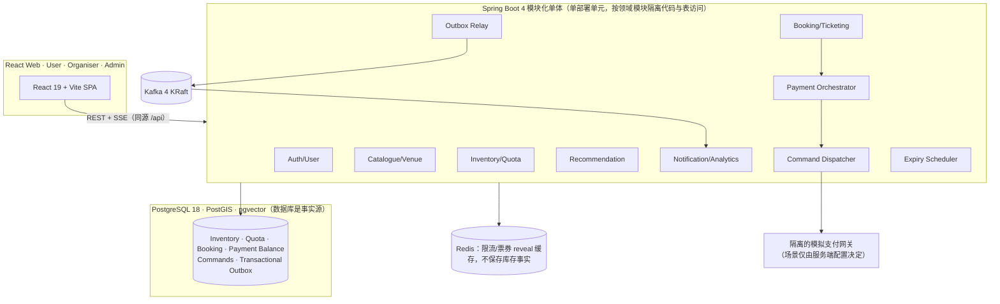
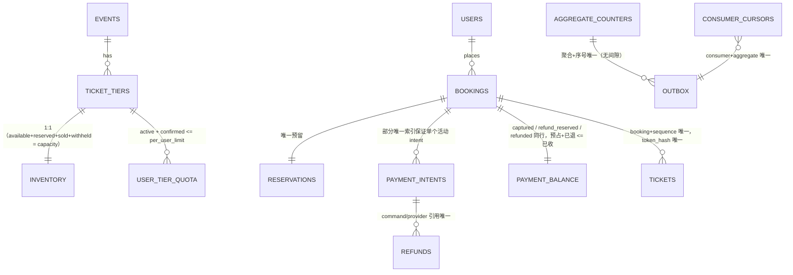
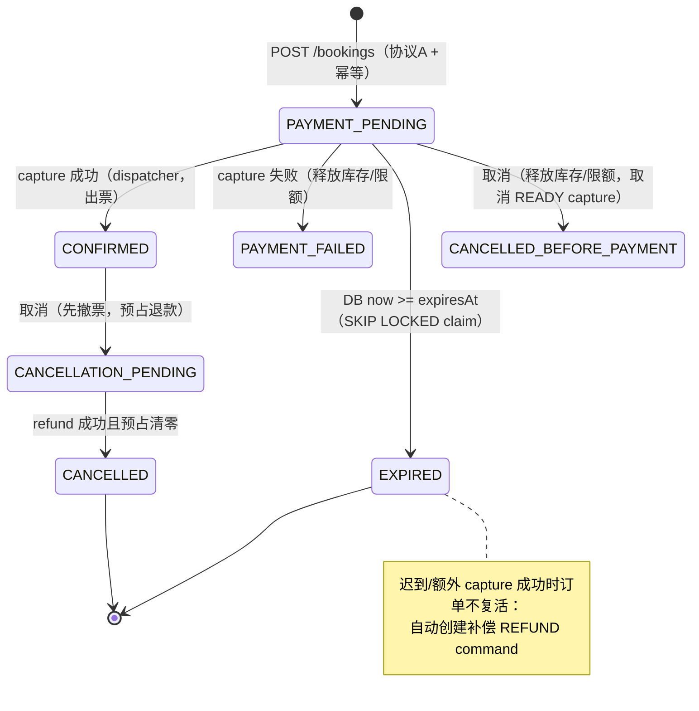
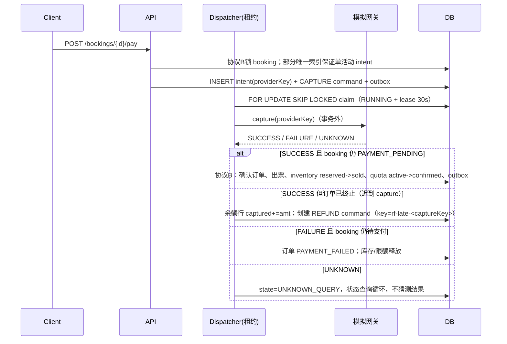
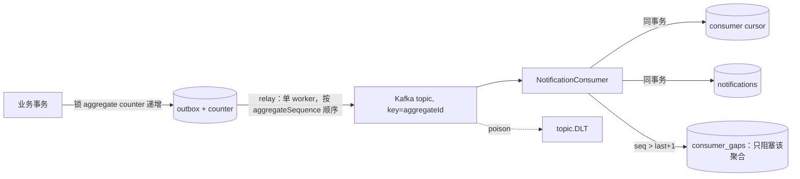

# 架构与流程图

## 1. 系统架构



- **资源舱壁**：交易写连接池（hikari tx-pool）与搜索/推荐查询分离超时与并发限制；推荐查询失败降级热门榜单。
- **外部调用异步**：支付/退款/通知先落 durable command + outbox，dispatcher 在事务外调用，结果以新事务落库并写 outbox。

## 2. 简化 ER（含不变量）



## 3. Booking 履约状态机



退款状态（booking.refund_state）：NONE → PENDING → REFUNDED / REFUND_FAILED / MANUAL_REVIEW；
退款失败时预占保留，人工"放弃"才释放并审计。

## 4. 创建预订（协议 A）时序

```mermaid
sequenceDiagram
    participant C as Client
    participant A as API
    participant I as Idempotency
    participant DB as PostgreSQL

    C->>A: POST /bookings (Idempotency-Key: >=128bit)
    A->>I: HMAC(key)->keyDigest; canonical(body)->requestHash
    A->>DB: INSERT idempotency (同事务 claim)
    alt 冲突
        DB-->>A: 等首事务提交后读取
        A-->>C: 409（hash 不同）/ 重放响应 / 202 Retry-After
    end
    A->>DB: UPSERT quota; SELECT quota FOR UPDATE
    A->>DB: SELECT inventory FOR UPDATE
    A->>DB: UPDATE inventory SET available-=q,reserved+=q WHERE available>=q
    A->>DB: UPDATE quota SET active+=q WHERE active+q+confirmed<=limit
    A->>DB: INSERT booking(PAYMENT_PENDING, expiresAt=DB now+ttl) + reservation + outbox
    A->>DB: idempotency -> COMPLETED(201,响应)
    A-->>C: 201 {bookingId, expiresAt, snapshot}
```

任何一步失败：整个事务回滚（包括幂等 claim 与 counter），无库存残留。

## 5. 支付 / 迟到 capture 补偿时序



命令重试上限后进入 MANUAL_REVIEW；人工重试复用原 providerKey（admin endpoint + 审计）。

## 6. 有序 Outbox 与消费者



- 发布成功后标记前宕机 → 重复发布（设计内），消费者按 cursor 去重。
- offset 提交在 DB commit 之后，kill 后重放安全。
- Gap 恢复三选一（全部审计）：修复后重放 / 从可信快照重建游标 / 双人批准跳过。
