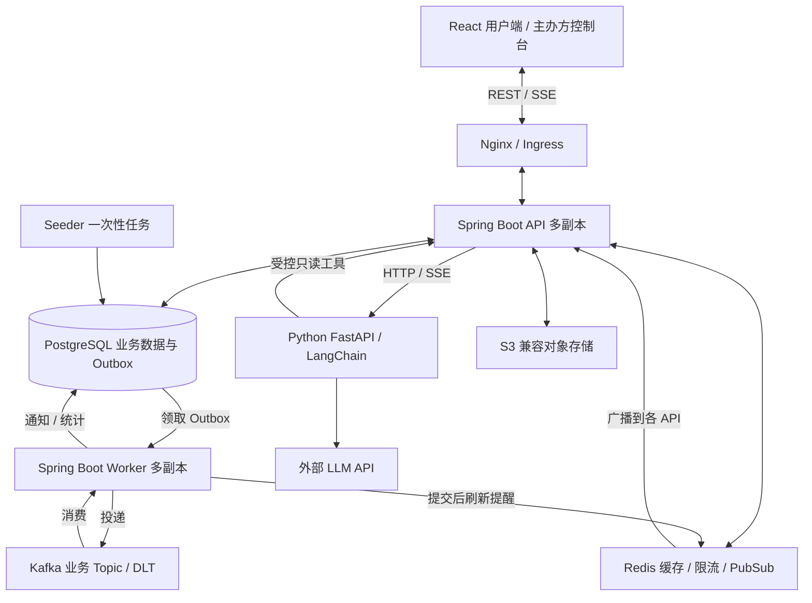
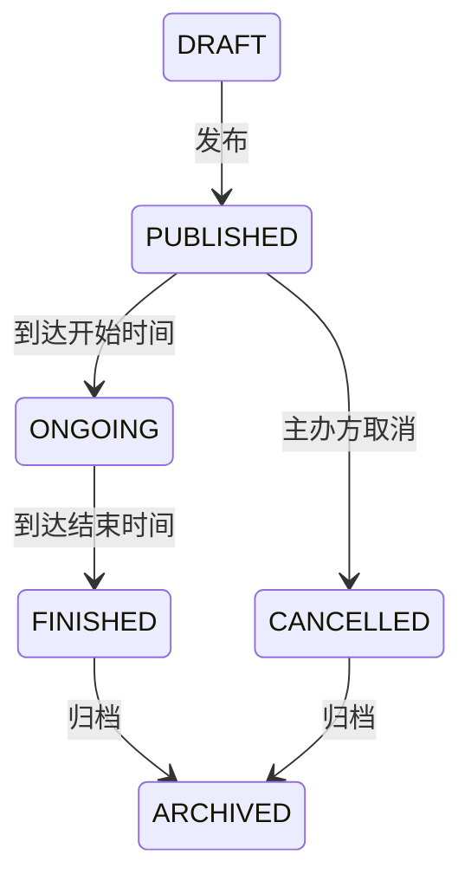

# EventPulse 项目架构总览

> 汇总日期：2026-09-09。本文整合仓库中 6 份非 README Markdown 文档，并对关键设计与当前代码、数据库迁移及部署配置进行核对。历史计划与实现不一致时，以当前实现为准；本文不代表已完成运行环境验收。

## 1. 项目定位与总体设计

EventPulse 是活动发现、售票与主办方运营平台。参与者可以搜索活动、使用 AI 找活动、收藏、加入购物车、预订、查看电子票与钱包流水；主办方可以创建与发布活动、管理订单和参与者、核销票据、查看运营数据。

业务闭环为：**创建草稿 → 发布售票 → 预订与出票 → 参与者管理与核销 → 结束归档**。取消订单或活动时，系统同步处理站内退款和票据失效，再异步生成通知与统计。

整体采用 **Spring Boot 分层业务应用 + 独立 Python AI 服务 + 异步事件处理**。Java 后端使用同一套代码和同一镜像，通过 Profile 分成 API、Worker、Seeder 三种运行角色，共享 PostgreSQL。订单、库存和钱包仍处于单库本地事务中，没有拆成独立微服务或引入跨服务 Saga。



PostgreSQL 是业务事实源；Kafka 承载持久化异步事件；Redis 和 SSE 提供刷新提醒。消息或提醒延迟，不改变已经提交的订单、余额和库存。

## 2. 技术栈与运行角色

| 层次 | 当前技术与职责 |
| --- | --- |
| 前端 | React 19、TypeScript、Vite、React Router；i18next 提供中英文界面 |
| Java 后端 | Java 21、Spring Boot 4、Servlet MVC、JPA 与原生 SQL、Flyway |
| AI 服务 | FastAPI、LangChain、Pydantic、HTTP 工具客户端；运行时调用外部模型 |
| 数据库 | PostgreSQL；保存业务事实、幂等记录、Outbox、会话与统计 |
| 消息 | Kafka；订单、钱包、购物车三个业务 Topic 及各自 DLT |
| Redis | 热门缓存、AI 共享限流、跨 API 实例的 SSE 提醒广播 |
| 图片存储 | 本地磁盘或 S3 兼容存储；多 API 副本应使用共享对象存储 |
| 部署 | Docker Compose、Nginx、Kubernetes Deployment / Service / Job / Ingress |

| 运行角色 | 承担工作 | 扩展方式 |
| --- | --- | --- |
| `api` | HTTP、鉴权、业务事务、AI 网关、SSE 连接与 Redis 订阅 | 负载均衡后部署多个副本，不消费 Kafka |
| `worker` | Outbox 投递、Kafka 消费、生命周期推进、媒体清理、AI 历史清理 | 数据库领取租约与 Kafka 分区协调多个副本；仅保留健康检查等运维入口 |
| `seeder` | 初始化演示数据，使用 `seed_runs` 避免重复播种 | 一次性进程或 Kubernetes Job，不启动 Web 服务 |
| `ai-service` | 文案生成、活动发现 Agent、流式回答 | 独立镜像；会话由 Java 后端持久化 |

## 3. 代码组织与业务职责

Java 包根为 `backend/src/main/java/dev/kaiwen/eventpulse/`，实际按技术层组织：

```text
controller → service → repository → PostgreSQL
     │          │
     │          ├─ outbox / kafka / sse
     │          └─ storage / AI HTTP client
     └─ dto / common.Result / exception

interceptor  请求鉴权与日志
domain       状态及类别规则
entity       数据库实体
worker       周期任务
seed         演示数据初始化
```

Controller 处理协议和入参，Service 组织权限、业务规则及事务，Repository 封装查询和原子更新。接口使用 DTO/VO 与统一 `Result` 响应，避免直接暴露实体。SSE 成功响应使用事件流，开流前的鉴权与业务错误仍可返回 JSON。

| 业务领域 | 主要实现 | 关键职责 |
| --- | --- | --- |
| 身份 | `AuthService`、`JwtService`、`JwtInterceptor` | 注册登录、JWT 解析、用户上下文 |
| 活动 | `EventService`、`OrganiserEventService`、`PlatformService` | 目录、附近、生命周期、主办方 CRUD、收藏与看板 |
| 库存 | `EventRepository` 的条件更新 | 原子增减 `events.sold`，与下单或取消共享事务 |
| 订单与结算 | `BookingService`、`CheckoutService` | 直接预订、批量结算、订单历史、取消、请求幂等 |
| 购物车 | `CartService` | 持久化购物意向、数量合并、价格快照与失效原因 |
| 钱包 | `WalletService` | 原子余额变动、追加流水、业务去重、钱包事件 |
| 票据 | `TicketService`、`TicketCodes` | 按张出票、票码校验、核销与撤销 |
| 消息与统计 | `OutboxWriter`、三个 Consumer、`InteractionService` | 可靠投递、幂等消费、通知及聚合数据 |
| AI 网关 | `AiGatewayService`、`AiServiceClient`、`AiRateLimiter` | 权限、限流、模型服务调用、结果复核、会话及日志 |
| 媒体 | `MediaService`、`MediaStorage` | 上传校验、所有权、图片读取、软删除与对象清理 |

旧计划中的 Inventory 是职责划分；当前没有独立的 `InventoryService`。库存原子操作实际位于 `EventRepository`，由业务服务调用。

前端入口为 `frontend/src/App.tsx`，`pages/` 承载用户页面，`organiser/` 承载运营界面，`components/` 和 `ui/` 提供复用组件，`api.ts` 统一 HTTP 调用，`lib/sse.ts` 处理事件流，`auth.tsx` 管理登录态。前端路由保护用于界面体验，后端仍必须独立鉴权。

## 4. 数据模型与事实归属

| 数据组 | 表 | 作用 |
| --- | --- | --- |
| 身份与偏好 | `users`、`user_preferences` | 账号、角色、余额与账户流水序号、发现偏好 |
| 活动 | `events`、`event_audit_logs`、`event_favourites` | 活动状态、容量与已售数量、版本、运营审计、收藏 |
| 交易 | `bookings`、`tickets`、`checkouts`、`cart_items` | 订单价格快照、独立票据、结算幂等记录、购物车 |
| 资金 | `wallet_ledger` | 追加式收支流水、变动前后余额、账户序号、业务去重标识 |
| 消息 | `outbox`、`consumed_events`、`notifications` | 待发送事件、消费者去重、持久化用户通知 |
| 统计 | `interactions`、`event_daily_metrics`、`cart_daily_stats`、`cart_seen_item_versions` | 行为明细、日聚合、购物车旧版本过滤 |
| AI | `ai_conversations`、`ai_messages`、`ai_requests` | 用户会话、消息、调用状态与耗时及用量 |
| 资源与初始化 | `media_assets`、`seed_runs` | 图片元数据与生命周期、播种执行记录 |

主要关联为：用户拥有订单、购物车、流水与会话；主办方拥有活动；活动关联多张订单；每张订单关联多张票据；一次结算可以关联多个活动的独立订单。

核心约束：

- 库存满足已售数量不超过容量，扣款不能让余额为负。
- 金额以整数“分”保存；订单保留实付快照，退款不按活动现价重算。
- `(user_id, idempotency_key)` 标识一次结算，钱包业务去重键标识一次资金变化。
- 同一用户、同一活动只有一行购物车记录和一条收藏关系。
- 票据状态是核销事实，订单签到摘要由票据聚合。
- 统计、缓存和 SSE 提醒不能用于决定是否可扣款或是否有库存。

Flyway 当前迁移为 V1–V5：V1 初始化主业务基线，V2 加入购物车、钱包流水与结算，V3 优化购物车稳定排序索引，V4 加入活动类别白名单，V5 加入 AI 会话清理索引。Hibernate 使用 `ddl-auto: validate` 验证实体与表结构。

## 5. 关键业务链路与事务边界

### 5.1 活动生命周期



主办方操作需同时满足登录、`ORGANISER` 角色、活动所有权和当前状态规则。编辑携带版本号，冲突时要求刷新。定时状态转换由 Worker 执行。公开列表、历史详情与主办方视图采用不同的可见性规则，结束或归档不会删除用户历史订单。

### 5.2 直接预订

同一个 PostgreSQL 事务完成：校验活动及售票时间 → 原子占用库存 → 保存订单价格快照 → 扣余额并记录流水 → 生成电子票 → 写入业务 Outbox。任一步失败，整个事务回滚；HTTP 不等待 Kafka 投递。

防超卖核心是数据库条件更新，而非在 Java 中先读后写：

```sql
UPDATE events
SET sold = sold + :qty, updated_at = now()
WHERE id = :id
  AND status = 'PUBLISHED'
  AND sold + :qty <= capacity;
```

更新行数为零即占用失败。免费订单正常出票，但不产生虚假的资金流水。直接预订带 `Idempotency-Key` 时复用结算幂等机制；不带键的不同请求按独立下单处理。

### 5.3 购物车与批量结算

加入购物车只保存购买意向，不占库存、不扣余额。同一活动再次加购合并数量，每项保留价格快照；活动失效、库存不足、超限、价格变化均向用户说明。价格变化需要用户确认更新快照后再结算。

结算以一次数据库事务处理所有勾选项：登记幂等键，锁定本用户对应购物车行，重新校验，按活动 ID 升序占库存，为每个活动生成独立订单、票据及扣款流水，写入订单、钱包与结算汇总事件，再减去实际购买数量。

任一项失败整次回滚，购物车保留原状。行锁协调多设备修改；按实际购买量扣减，避免误删其他设备新增数量。活动在前、钱包在后的锁顺序减少不同交易路径的锁冲突。

同键同参数重试返回原订单，即使购物车已经清空；同键不同参数拒绝；失败事务中的幂等记录一起回滚，允许重试。

### 5.4 取消、退款与核销

取消流程在事务内协调活动、票据、订单和钱包：校验取消条件，条件更新订单状态，释放库存，按 `paid_cents` 退回站内余额、追加退款流水，使票据失效并写 Outbox。票据锁用于协调取消与核销的竞争，订单状态条件更新和流水唯一键防止重复退款。

每张电子票可独立核销，重复核销被拒绝；撤销核销受主办方权限和业务规则控制。用户取消与主办方取消活动采用各自的校验规则。

钱包充值是演示入口，不连接真实支付渠道；站内扣款与退款实际入账。充值可使用幂等键，旧账户迁移通过 `OPENING_BALANCE` 记录期初余额，不编造历史交易。

## 6. Outbox、Kafka 与最终一致性

### 6.1 投递与多 Worker 协调

业务事件和业务数据在同一事务中写入。Worker 通过 `FOR UPDATE SKIP LOCKED` 原子领取待发送消息，记录领取令牌和租约；每条发送前续租，进程崩溃后其他 Worker 可在租约到期后接手。

Relay 在数据库事务之外等待 Kafka 确认，成功后通过短事务设置 `published_at`。同一消息 Key 的早期未发布事件会阻止后续事件被领取；隔离的坏消息不继续阻塞队列。

| 投递结果 | 处理方式 |
| --- | --- |
| Kafka 确认成功 | 标记已发布并清除领取状态 |
| 临时故障或整体配置问题 | 记录错误，保留待发送状态，后续轮询重试 |
| 消息本身不可发送 | 设置 `failed_at` 隔离，继续处理其他消息 |
| 未知错误 | 累计失败，达到当前实现的 5 次阈值后隔离 |
| Kafka 成功、数据库标记失败 | 后续可能重复发送，由消费端幂等兜底 |

这里提供的是允许重复的可靠投递与幂等副作用，不是跨 PostgreSQL 和 Kafka 的端到端 exactly-once。

### 6.2 事件与消费者

| Topic | 事件 | Key | 消费组与副作用 |
| --- | --- | --- | --- |
| `booking-events` | `BOOKING_CREATED`、`BOOKING_CANCELLED`、`EVENT_CANCELLED` | `booking:{id}` | `eventpulse`：通知、订单行为统计、刷新提醒 |
| `wallet-events` | `WALLET_LEDGER_RECORDED` | `wallet:{userId}` | `eventpulse-wallet`：充值通知、钱包刷新提醒 |
| `cart-events` | 加入、修改、移除、结算完成 | `cart:{userId}` | `eventpulse-cart`：购物车日统计、刷新提醒 |

消费者把 `(consumer_group, dedup_key)` 去重记录与通知、统计副作用放在同一个数据库事务内。副作用失败时去重记录一起回滚，重放仍可处理。购物车通过版本记录过滤旧事件；结算统计按汇总事件累计，避免按每张订单重复计算。

消费失败采用有限重试，当前配置每隔 1 秒再试、最多重试 4 次，随后发送到 `<topic>.DLT`。DLT 投递失败也不能视作原消息处理成功。人工重放应保留业务去重标识。

同 Key 进入同一 Kafka 分区，但不同 Topic 没有全局顺序。消费者及页面不能依赖钱包事件和订单事件的到达先后。

## 7. 实时更新：通知 SSE 与 AI SSE

### 7.1 业务刷新提醒

链路为：**Worker 消费并提交数据库事务 → Redis Pub/Sub → 所有 API 实例 → 各实例本地 SSE 连接 → 浏览器重新读取 REST**。

`GET /api/bookings/{id}/events` 提供订单级订阅，`GET /api/user/events` 提供用户级订阅。连接保存在所属 API 的 `SseConnectionRegistry` 中，属于瞬时连接状态；无需把连接本身放入 Redis，也不依赖粘性会话。

订阅前校验用户身份与订单归属，连接包含超时、清理、数量限制和默认 25 秒心跳。前端使用 `fetch + ReadableStream`，以便携带 Authorization 请求头；断线后指数退避重连，重新连接时通过 REST 补齐数据。

Redis Pub/Sub 不持久化提醒。提醒失败不回滚业务，也不保证自动补发每条提醒；页面刷新和重连后的 REST 查询承担补偿。

### 7.2 AI 活动发现流式回答

AI 请求通过 `POST /api/ai/discovery/chat/stream` 进入 Java 网关，再调用 Python 的内部流式接口。它是一次问答的响应流，与长期业务提醒订阅分开处理。

当前实现采用**增量解析 JSON 信封**：模型仍输出 `answer`、`events`、`follow_up_questions`，Python 的 `EnvelopeStreamExtractor` 只提取 `answer` 字符串作为 `delta`，处理转义和 Unicode，避免把原始 JSON 展示给用户。

Python 最后发出 `result`；Java 复核完整活动列表，持久化登录用户会话，然后发送包含完整答案、活动卡片和追问的 `done`。前端以最终结果校正增量展示。失败发送 `error`，没有正常收尾也视为异常，不自动重新执行整轮问答。

Java 在请求线程中完成限流并捕获身份，再交给虚拟线程转发 SSE；不能在异步线程依赖已经被清理的 `BaseContext`。原同步接口继续保留。业务订阅的心跳不能直接视为 AI 流也已具备同样保障，AI 请求还需依赖自身预算、超时和断流处理。

## 8. AI 服务边界

AI 有两条用途：主办方文案助手生成可审核的内容建议；活动发现 Agent 根据自然语言调用只读业务工具，推荐真实活动。文案须由主办方确认后再通过普通业务接口保存。

Python 的 `tools.py` 提供搜索公开活动、附近活动、热门活动和活动详情工具；登录上下文下还可读取用户偏好及近期类别。工具经 `backend_client.py` 回调 Spring 内部接口，不直连业务数据库。

防护分为两层：Python 用 `ToolLedger.allowed_event_ids` 校验活动引用必须来自本轮工具结果；Java 用 `verifyEvents` 再检查当前可见性。卡片在最终结果中发布，增量正文属于尚未收尾的模型输出，不能等同于逐字完成事实核验。

服务间调用通过独立令牌及用户上下文校验，LLM Key 只配置在 Python 服务中。Python 不提供公网入口，AI 不直接发布活动、下单、核销或修改库存与余额。

会话与调用日志由 Java 写入 PostgreSQL；Worker 按保留期清理。限流优先使用 Redis 共享窗口，不可用时降级为实例内窗口，此时多副本总配额精度会下降。模型调用或工具失败应明确返回不可用，不使用编造数据替代业务查询。

## 9. 部署、存储与故障边界

当前 Compose 默认运行 2 个 API、2 个 Worker、1 个 Python AI 服务及一次性 Seeder，基础设施为单节点 PostgreSQL、Redis 和 Kafka。前端 Nginx 提供统一入口。`edge` 网络只连接前端与 API，`backplane` 连接应用内部组件与基础设施。

Kubernetes 清单位于 `deploy/k8s/`，提供 API、Worker、AI Deployment，相关 Service、配置与 Secret 示例、Seeder Job 和 API Ingress；数据库、Kafka 等基础设施以及前端对外部署需由实际环境配套。仓库清单不能据此视作完整生产高可用方案。

媒体通过 `MediaStorage` 抽象连接本地文件系统或 S3 兼容服务。多 API 实例需要共享对象存储，否则不同实例不能可靠读取彼此上传的图片。媒体记录保存在数据库中，Worker 在宽限期后清理软删除对象。

| 故障 | 对用户和数据的影响 |
| --- | --- |
| Kafka 不可用 | 已运行的 API 仍可提交业务事务；通知和统计延迟，Outbox 等待重试 |
| Redis 不可用 | 热门查询回源数据库，实时提醒可能丢失，AI 限流退回本地窗口 |
| API 实例退出 | 当前 SSE 断开；业务订阅可重连其他实例并重新查询 |
| Worker 退出 | Outbox 租约到期后可接管，Kafka 消费分区重新分配 |
| AI 服务或模型不可用 | AI 功能返回失败，普通活动与交易功能仍由 Java 服务处理 |
| PostgreSQL 不可用 | 核心读写与交易无法完成；消息和缓存不能替代数据库事实 |

## 10. 可观测性与验收重点

业务看板展示事件互动、转化与 Outbox 积压等数据；日志使用 requestId 串联 HTTP 请求与处理过程。当前 Actuator 配置公开 `health`、`info`，包含健康探针。代码中的 Micrometer 指标不等于已经部署 Prometheus 抓取与仪表盘；Kafka lag、DLT 消息数等需部署侧监控配合。

仓库 CI 配置包括 Java 的 `mvn -B verify`（单测、集成测试、静态分析及覆盖率）、前端 lint / coverage / build / Playwright、Python pytest、Compose 与 Kubernetes 配置校验、密钥扫描及依赖检查。后端行覆盖率门槛为 90%；前端语句、行、函数为 80%，分支为 70%。这些是现有门禁说明，本次文档整理未运行整套测试。

人工验收主要覆盖以下架构承诺：

1. 并发购买不超卖、不透支；失败结算不会留下部分订单、扣款或已移除的购物车项。
2. 同幂等键重试不重复下单或充值；取消与核销竞争不重复退款。
3. Kafka 停止时订单仍能提交，恢复后通知补齐，重复消息不重复产生副作用。
4. 多 API、多浏览器下提醒可跨实例送达；断线后 REST 可恢复真实状态。
5. AI 正文逐步显示，最终卡片经过校验，异常断流明确失败，会话可延续。
6. 迁移保留旧账户余额，期初流水可核对；重复 Seeder 执行不重复生成数据。

## 11. 历史文档归并与差异说明

本文汇总的 6 份来源如下；所有 README 均排除在汇总来源之外。`流式输出.md` 的架构内容已合入第 7.2、8、10 节，原文件已删除；其余来源文档保留供追溯。

| 来源文件 | 纳入的内容 |
| --- | --- |
| `eventpulse-development-plan.md` | 项目定位、角色、分层、活动生命周期、业务模块、AI 边界、质量要求 |
| `eventpulse-distributed-deployment-plan.md` | API / Worker / Seeder 职责、跨实例 SSE、领取机制、部署与扩容 |
| `eventpulse-outbox-reliability-refactor-plan.md` | Kafka 确认后标记、失败分类、幂等消费、DLT 与可靠性语义 |
| `docs/order-flow.md` | 订单、钱包、退款、购物车、结算幂等及事件协作 |
| `docs/acceptance-walkthrough.md` | 交易回滚、多设备同步、流水迁移、播种幂等的验收重点 |
| `流式输出.md`（已合并删除） | AI 流式信封、异步身份、最终校验、断流与前端协议要求 |

需要避免继续沿用的旧描述：

| 历史描述 | 当前仓库情况 |
| --- | --- |
| PostGIS 地理查询 | 当前基线使用普通 PostgreSQL，经纬度字段配合 `PlatformService` 的 Haversine 计算 |
| 按领域组织目录、独立 Inventory 服务 | Java 当前按技术层组织；库存条件更新在 `EventRepository` |
| 不做钱包、退款线下处理 | 已有站内钱包、支付快照、退款和流水；仍无真实支付渠道 |
| Outbox 仍待改造、不做 DLT | 已有确认等待、领取租约、失败隔离、消费幂等和 DLT |
| Python AI 服务待接入 | 已有独立服务、Compose 与 Kubernetes 清单、Java 网关 |
| AI 发现仅同步响应 | 已有三端流式路径，采用 JSON 信封增量提取 |
| Kafka 三节点为默认部署 | 仓库 Compose 当前为单节点 KRaft；三节点属于历史目标 |
| 媒体暂不处理 | 已有本地 / S3 存储抽象与后台清理 |
| 已具备完整 Prometheus 看板 | 当前公开 Actuator health / info，采集与展示需另外配置 |

历史文档中的逐步任务、旧代码片段、实施时间表和验收目标不作为当前实现承诺。后续维护优先更新本文的职责、数据模型、事务边界和部署事实，避免再次由多份计划分别定义现状。
