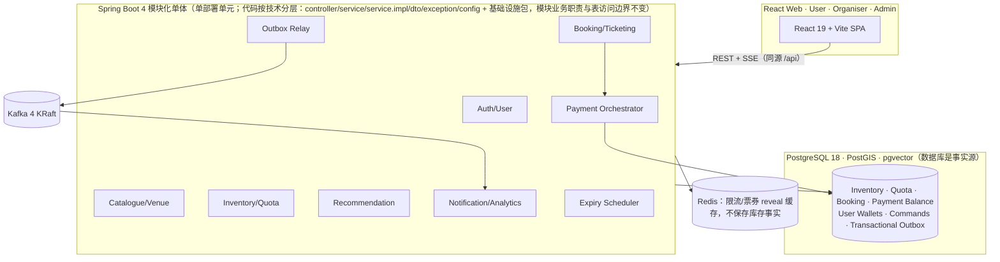
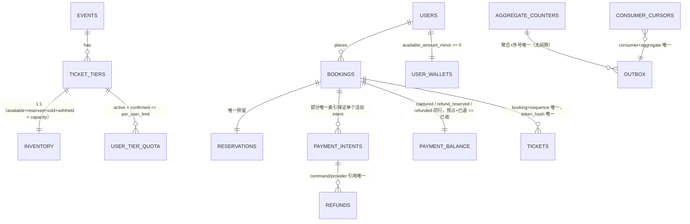
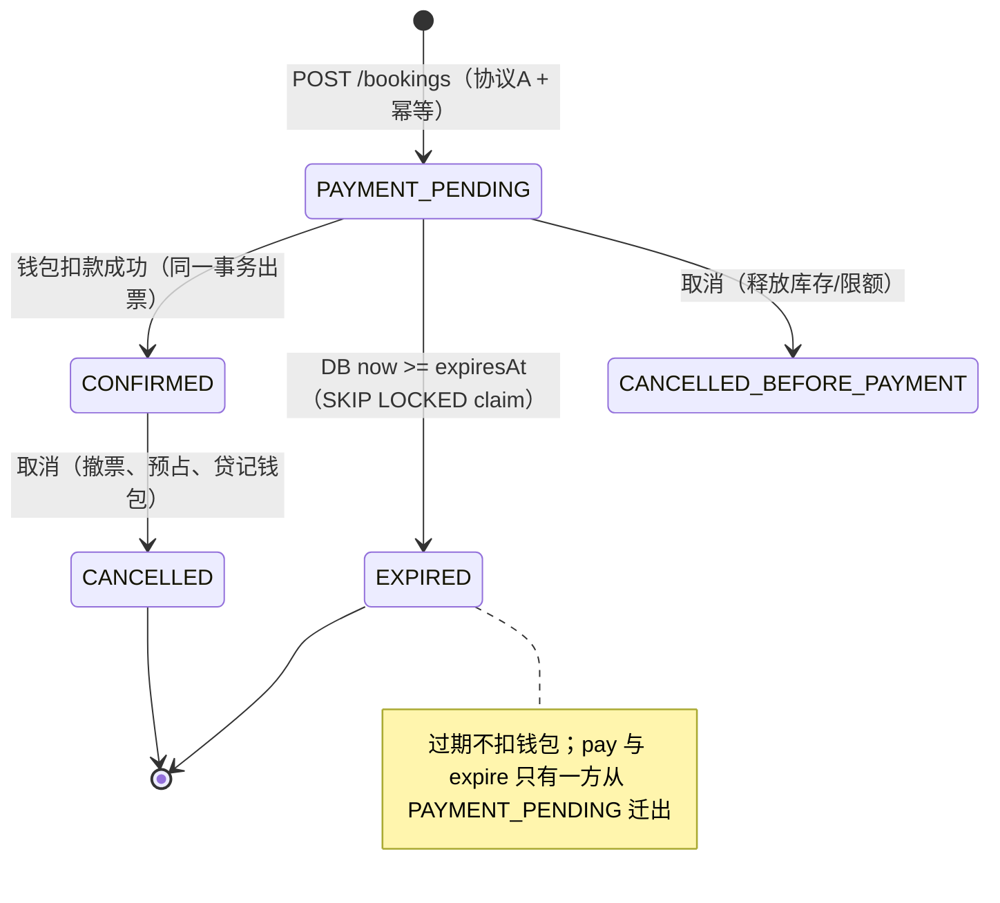
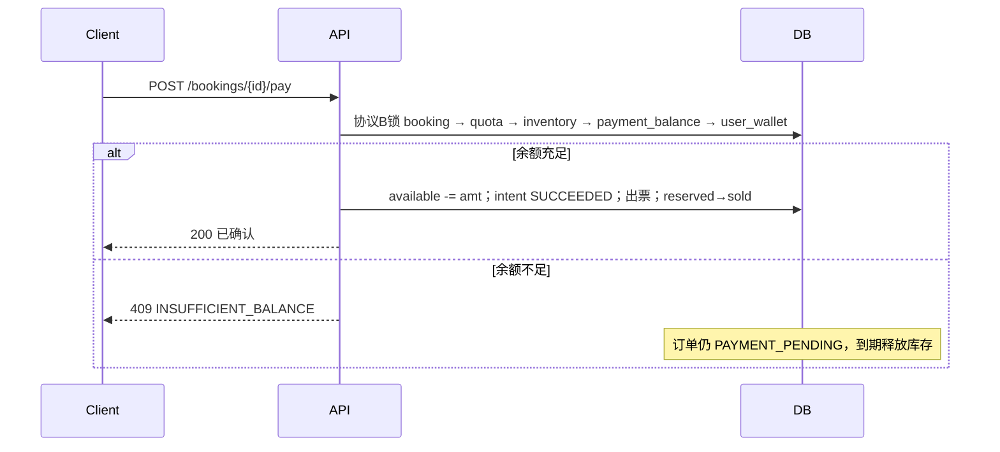
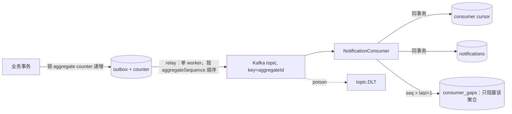

# 架构与流程图

## 1. 系统架构



- **资源舱壁**：交易写连接池（hikari tx-pool）与搜索/推荐查询分离超时与并发限制；推荐查询失败降级热门榜单。
- **支付在事务内**：扣款/退款借记/贷记 `user_wallets`，与订单确认/取消同一 PostgreSQL 事务；Kafka 发布仍走 outbox/relay。
- **代码分层组织**：代码目录按技术分层（`controller` 只做请求校验/当前用户/调用 Service 接口/组装响应；`service` 为业务接口；`service.impl` 为 `@Service` 业务实现并承载从 Controller 抽离的业务 SQL；`dto` 承载请求/响应/行 record；`exception`/`config`/`common`/`batch`/`outbox`/`payment` 为基础设施）。这只是代码目录与依赖方式的调整：数据库事务边界、上述领域模块的业务职责以及"不跨模块随意写表"等关键约束全部保持不变；认证过滤器、批处理、outbox 等基础设施 SQL 仍由其所属组件维护。

## 2. 简化 ER（含不变量）



## 3. Booking 履约状态机



退款状态（booking.refund_state）：NONE → REFUNDED（取消确认订单时同一事务完成）；
人工 abandon 仍可处理预占残留。

## 4. 创建预订（协议 A）时序

```mermaid
sequenceDiagram
    participant C as Client
    participant A as API
    participant I as Idempotency
    participant DB as PostgreSQL

    C->>A: POST /bookings (Idempotency-Key: >=128bit)
    A->>I: HMAC(key)->keyDigest; canonical(body)->requestHash
    A->>DB: INSERT idempotency (同事务 claim)
    alt 冲突
        DB-->>A: 等首事务提交后读取
        A-->>C: 409（hash 不同）/ 重放响应 / 202 Retry-After
    end
    A->>DB: UPSERT quota; SELECT quota FOR UPDATE
    A->>DB: SELECT inventory FOR UPDATE
    A->>DB: UPDATE inventory SET available-=q,reserved+=q WHERE available>=q
    A->>DB: UPDATE quota SET active+=q WHERE active+q+confirmed<=limit
    A->>DB: INSERT booking(PAYMENT_PENDING, expiresAt=DB now+ttl) + reservation + outbox
    A->>DB: idempotency -> COMPLETED(201,响应)
    A-->>C: 201 {bookingId, expiresAt, snapshot}
```

任何一步失败：整个事务回滚（包括幂等 claim 与 counter），无库存残留。

## 5. 钱包支付时序



取消确认订单时同一事务：撤销票券 → 预占 → 钱包贷记 → reserved→refunded → `CANCELLED`。

命令重试上限后进入 MANUAL_REVIEW 仍适用于非支付 command（NOTIFY 等）；人工重试复用原 providerKey（admin endpoint + 审计）。

## 6. 有序 Outbox 与消费者



- 发布成功后标记前宕机 → 重复发布（设计内），消费者按 cursor 去重。
- offset 提交在 DB commit 之后，kill 后重放安全。
- Gap 恢复三选一（全部审计）：修复后重放 / 从可信快照重建游标 / 双人批准跳过。
